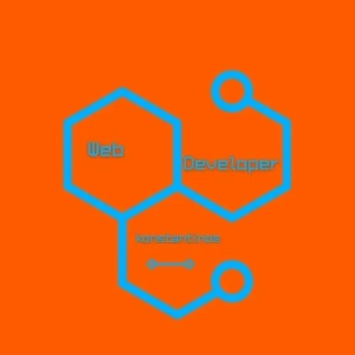

#  Hi, my name is Konstantinos Iakovou.
I am web developer and graduated at University of Ioannina in 2023. 

#  About me
I’m passionate about creating and designing, especially in web development. I enjoy facing challenges and learning new things. I’m organized and eager to contribute to a company’s success by applying my skills and experience. I’m confident in my abilities and always give my best.

# About my portfolio
I've loved creating and designing since I was a kid. Web development lets me learn new things and solve challenges every day, mostly through YouTube and the internet.

# [My Portfolio] 
- [My website](https://konstantinosiakovou.github.io/myportfolio/) 
- [Blog Parceiro De Conversação](https://parceirodeconversacao.com.br) 
- [Gorgos Iakovou website](Soon online)  
- [Grandma`s Sweets Project](https://konstantinosiakovou.github.io/grandmassweets/)  
- [Sanctuary Martial arts](Soon online)  
- [Εκπολιτιστικός Σύλλογος Βιταλιωτών "Τα Κοτυλαία"](https://konstantinosiakovou.github.io/vitalagr/) 
- [Σχολή Οδηγών Δημήτρης Ρέρρες](https://konstantinosiakovou.github.io/DimitrisRerresDrivingSchool/) 
- [Δημήτρης Πολιτάκης (Γνωστός από την συμμετοχή του στο Mastercef)](https://konstantinosiakovou.github.io/DPolitakis/) 
- [Little Lemmon portifolio](https://konstantinosiakovou.github.io/Little-Lemmon-portifolio/) 
- [Lucky_Shrub](https://konstantinosiakovou.github.io/Lucky_Shrub/) 
